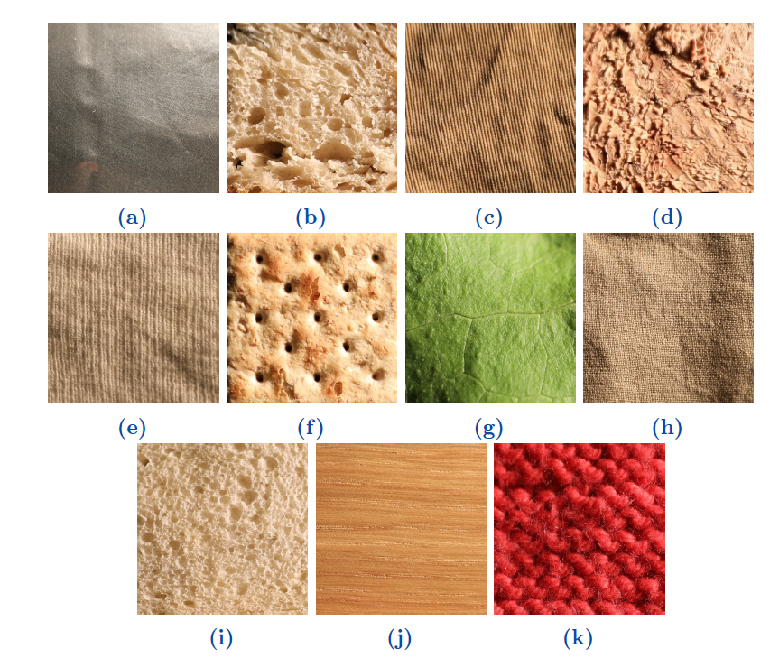
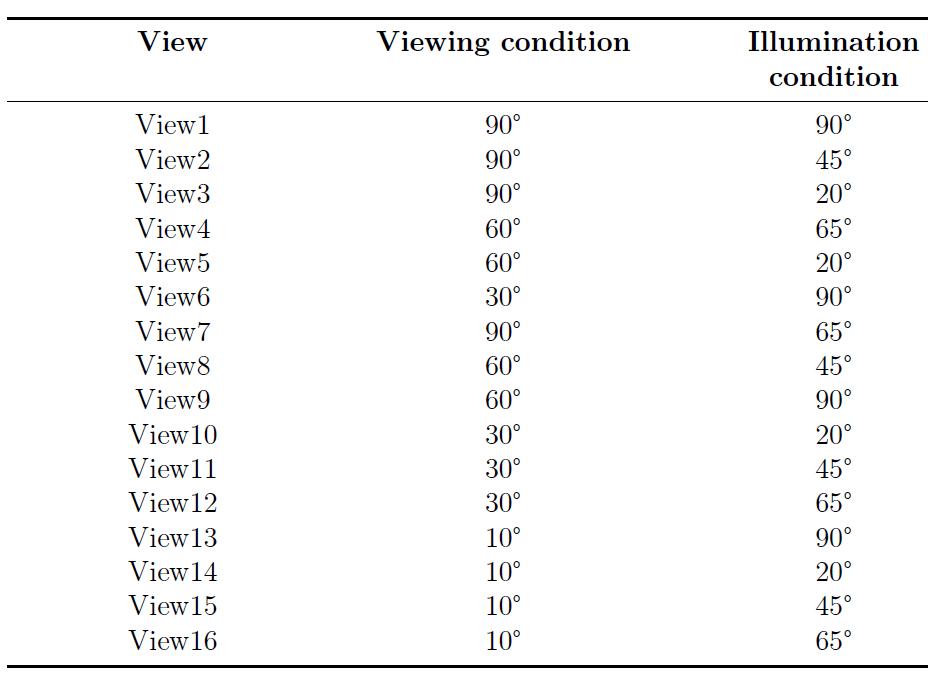
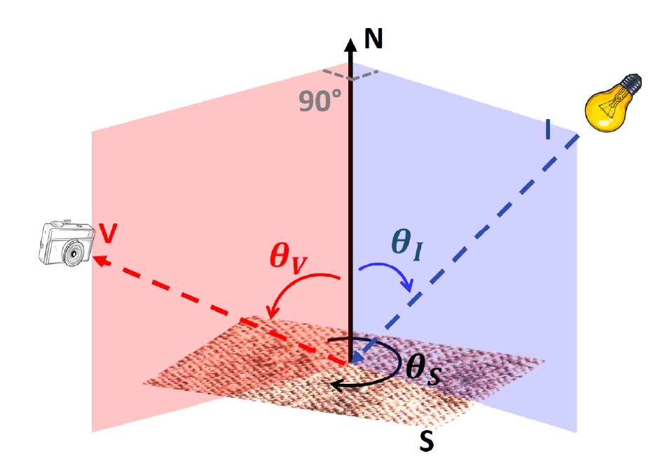
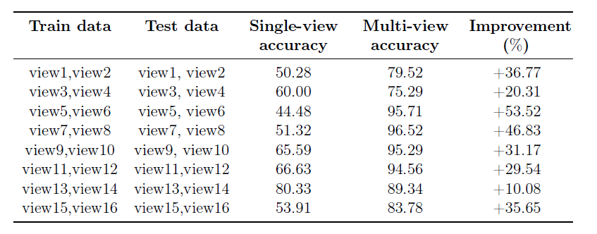
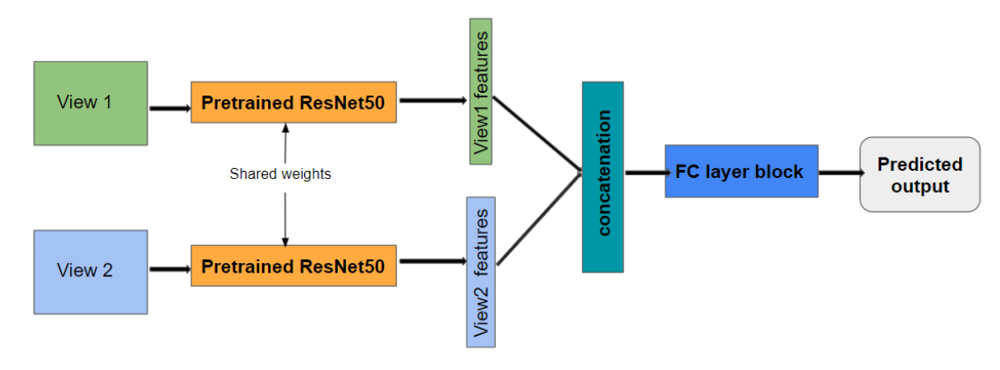

# UJM TIV
`UJM TIV` is a material dataset consist of images of 11 material classes `aluniminum foil`, `brown bread`, `corduroy`, `cork`, `cotton`, `cracker`, `lettuce leaf`, `linen`, `white bread`, `wood` and `wool`. Each image is a 20x20 RGB image. All of these categories are also presented in [KTH-TIPS2 Dataset](https://www.csc.kth.se/cvaatabases/kth-tips/credits.html). `UJM TIV` stands for `University Jean Monnet, Texture Under Varying Illumination, Pose and Viewing`. Our `UJM TIV` dataset provides images with higher intra class variability. Images were captured using `4 viewing (frontal/90°, 10°, 30°, 60°)` and `4 Lighting (frontal/90°, 20°, 45°, 65°)` conditions and 2 sample orientation in a controlled acquisition setup. 

Here is an example of a sample from 11 differnt categories:

In the above image `a. aluniminum foil`, `b. brown bread`, `c. corduroy`, `d. cork`, `e. cotton`, `f. cracker`, `g. lettuce leaf`, `h. linen`, `i. white bread`, `j. wood` and `k. wool`.

Each view folder contains images of 11 material categories captured with specific viewing and lighting conditions. The viewing and lighting conditions for the selected view images are shown in the following image:


The image acquisition setup is schemetically depicted in the image below. For the sake of our studies, the plane bounded by vectors N and I was positioned
perpendicular to the plane bounded by vectors N and V.




In this research we introduced multi-view learning solution for the material classification which clearly outperformed the traditional single view based deep learning solution which can be observed from above table. We employed a two branched siamese network which takes input from two different views and extract specific informattion from each views. In the end the extracted features are fusioned togather. The architecture of the proposed solution is shown in the image below. Our paper can be accessed online [Multi-view Learning for Material Classification](https://www.mdpi.com/2313-433X/8/7/186)



Images in each folder are named in format SampleNo_ImageNo_PatchNo_ExtractedImageFromPatch e.g S1_img_2_patch_7_8.JPG. Images for different views are chosen according to following table if its exist since for some sample it was difficult to extract patches as it was too blurry.
| 	View	  | 	Image No	 	|
| 	:-----:	| 	:-----:	 		|
| 	view1	| 	Image 1 & 17	| 
| 	view2	| 	Image 3 & 19	| 
| 	view3	| 	Image 2 & 18	| 
| 	view4	| 	Image 8 & 24	| 
| 	view5	| 	Image 16 & 22	| 
| 	view6	| 	Image 9 & 25	| 
| 	view7	| 	Image 4 & 20	| 
| 	view8	| 	Image 7 & 23	| 
| 	view9	| 	Image 5 & 21	| 
| 	view10| 	Image 10 & 26	| 
| 	view11| 	Image 11 & 27	| 
| 	view12| 	Image 12 & 28	| 
| 	view13| 	Image 13 & 29	| 
| 	view14| 	Image 14 & 30	| 
| 	view15| 	Image 15 & 31	| 	 
| 	view16| 	Image 16 & 32	| 
To split the views into train, test and validation folders [Python Split folders](https://github.com/jfilter/split-folders) module can be used.

If you use UJM TIV in a scientific publication, we would appreciate references to the following paper:
## [Multi-view Learning for Material Classification](https://www.mdpi.com/2313-433X/8/7/186)

Biblatex entry:
```
@article{sumon2022multi,
  title={Multi-View Learning for Material Classification},
  author={Sumon, Borhan Uddin and Muselet, Damien and Xu, Sixiang and Tr{\'e}meau, Alain},
  journal={Journal of Imaging},
  volume={8},
  number={7},
  pages={186},
  year={2022},
  publisher={MDPI}
```
If you have any questions feel free to contact me at `borhancse.cu@gmail.com`.
